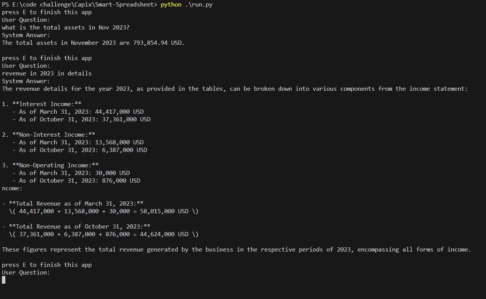

# Smart Spreadsheet

## Introduction

1. The algorithm should be able to parse and serialize each individual table in the Excel sheet example_0.xlsx.
2. An AI chat function that should be able to answer basic question about the excel sheet, e.g. "What is the Total Cash and Cash Equivalent of Nov. 2023?" (No UI is needed)
3. Let's broaden the functionality of the algorithm. Can you make it parse example_1.xlsx and example_2.xlsx?
4. Let's make the AI more intelligent. Can you make it answer questions that need to be inferred like "What is the Total Cash and Cash Equivalent of Oct. AND Nov. of 2023 combined?"
5. Now that we have a Smart Spreadsheet AI. Let's deploy it for our user to use!

## Strategy

1. Extracted Different Tables from spreadsheets
2. Trained GPT 4 Turbo with pre-processed tables
3. Informed GPT to answer the user's question in details based on the prepared data.

## Distribution

- Execution

```
# Install Python > 3.7
pip install -r requirements.txt
python run.py
```

Please ensure that you have OpenAI API key to run this application.

You can learn about how to get OpenAI API keys from https://www.maisieai.com/help/how-to-get-an-openai-api-key-for-chatgpt

## Development

```
# .env file
API_KEY =
```

Add api key in .env file to use Open AI API.

## Visual Result


